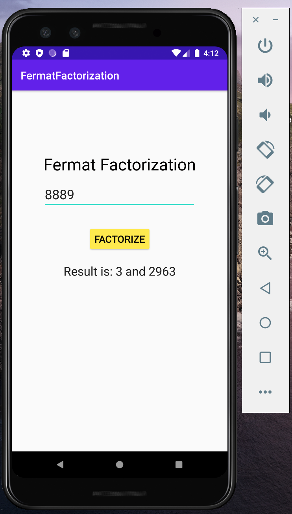
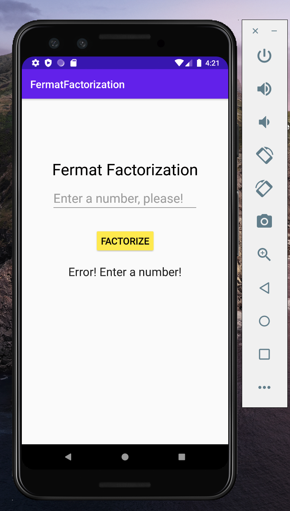

# RealTimeSystemsLab3.1
Fermat Factorization

Main core is fermat factorization algorithm, which you can find here:
RealTimeSystemsLab3.1/FermatFactorization/app/src/main/java/com/example/fermatfactorization/MainActivity.java

If you run the app in the emulator (Android Studio), you can see something like this:

If there will be no input: 

